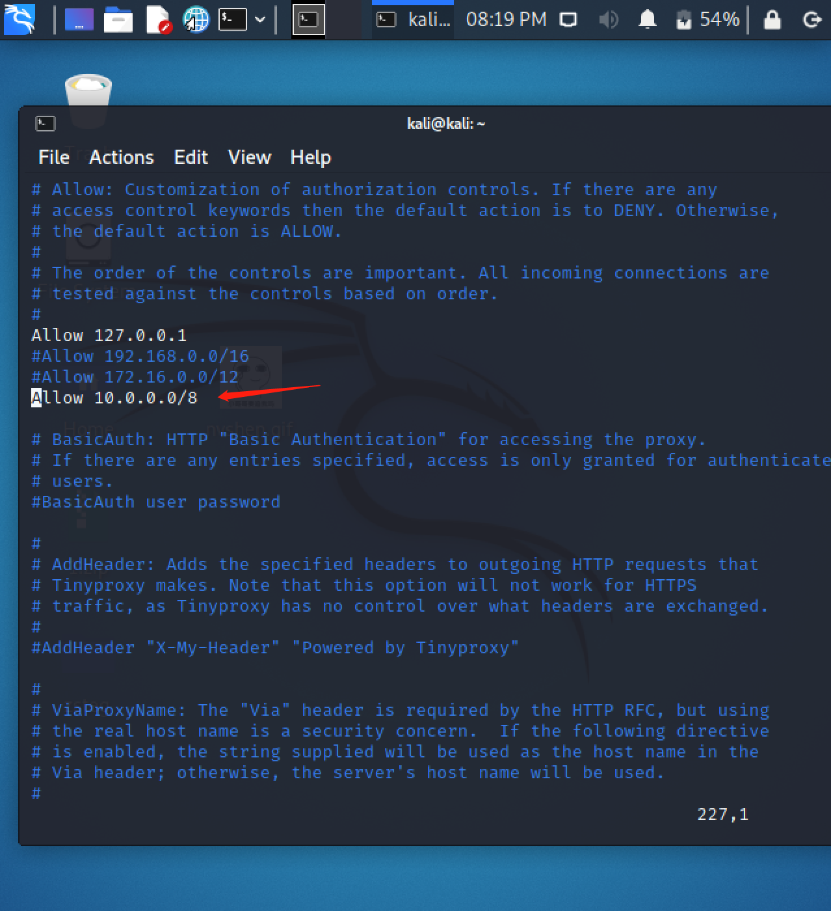
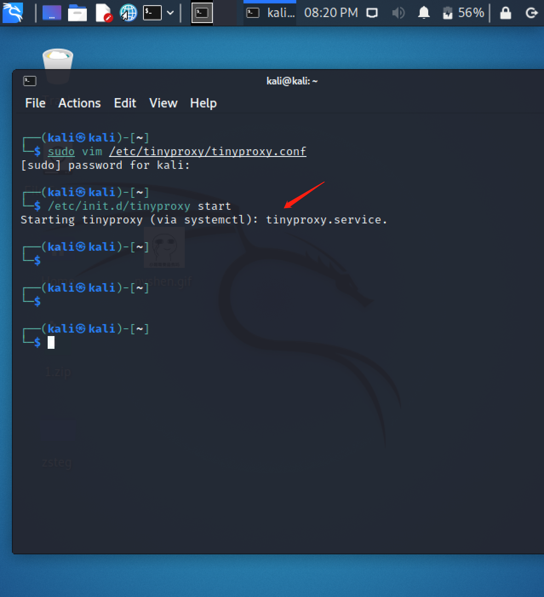
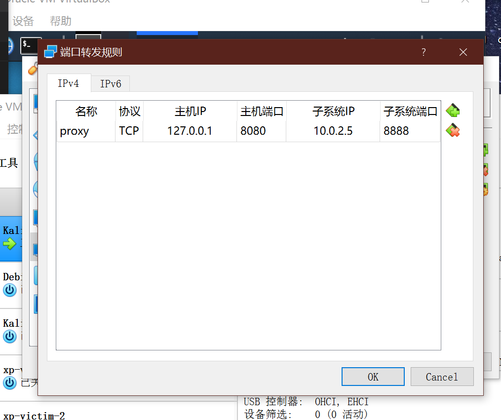
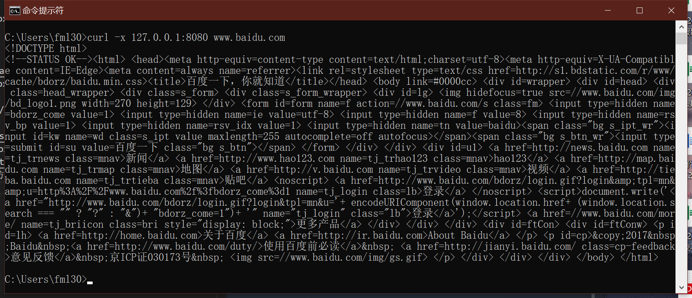
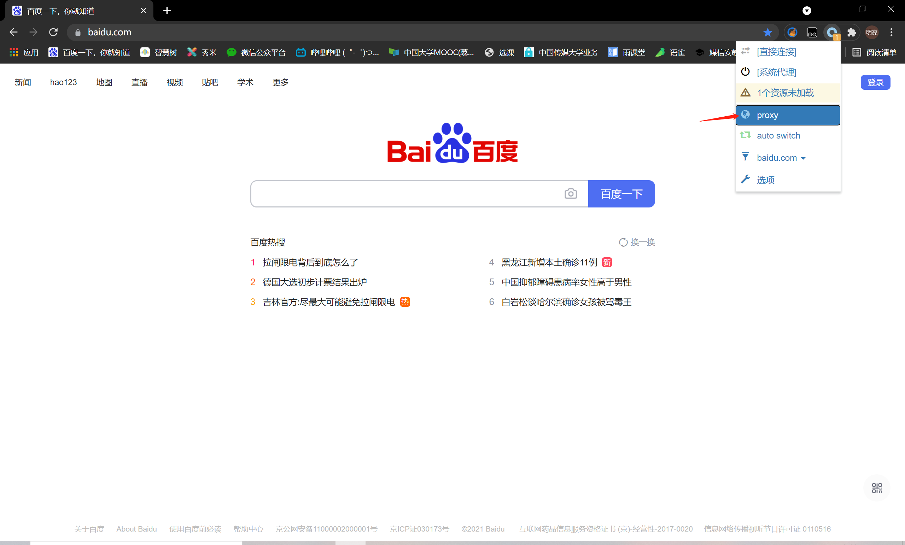
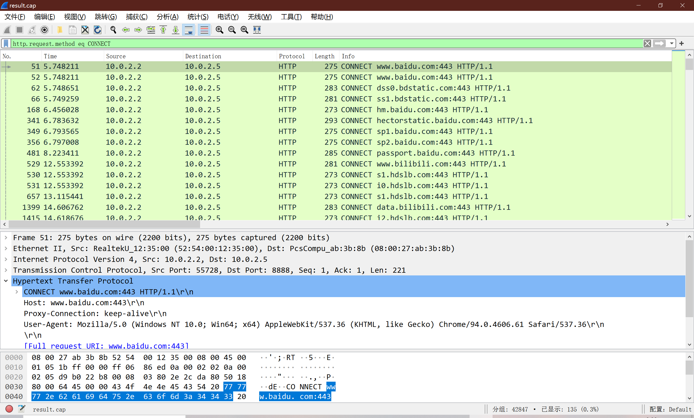
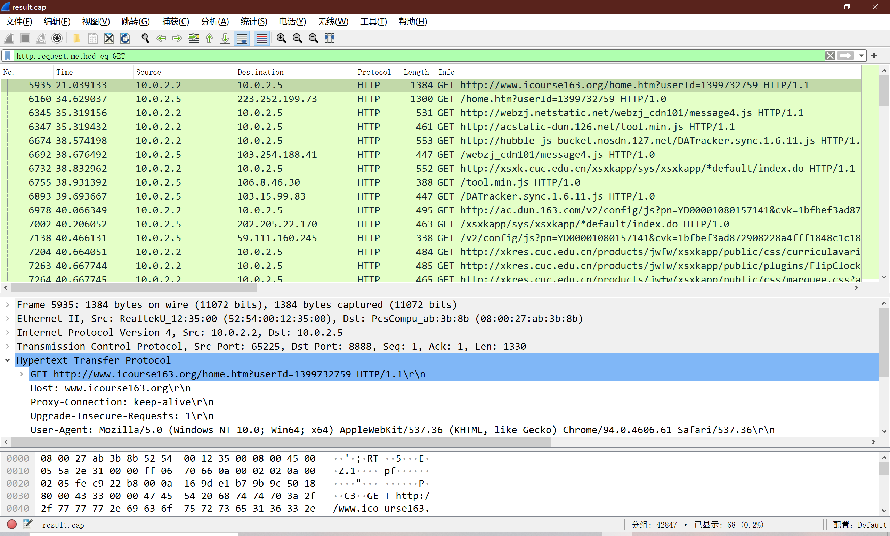
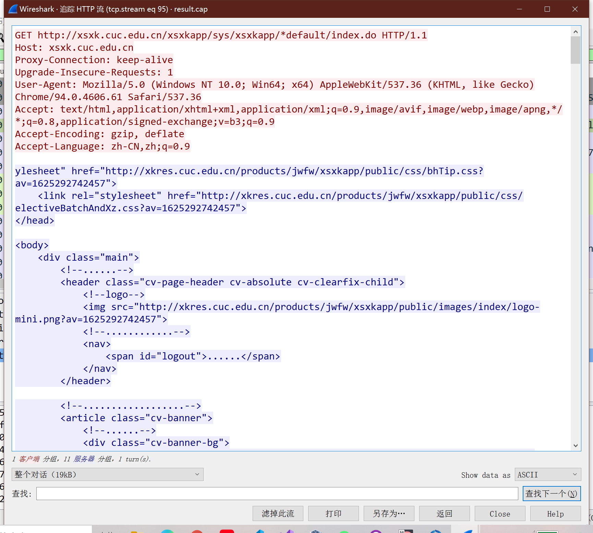
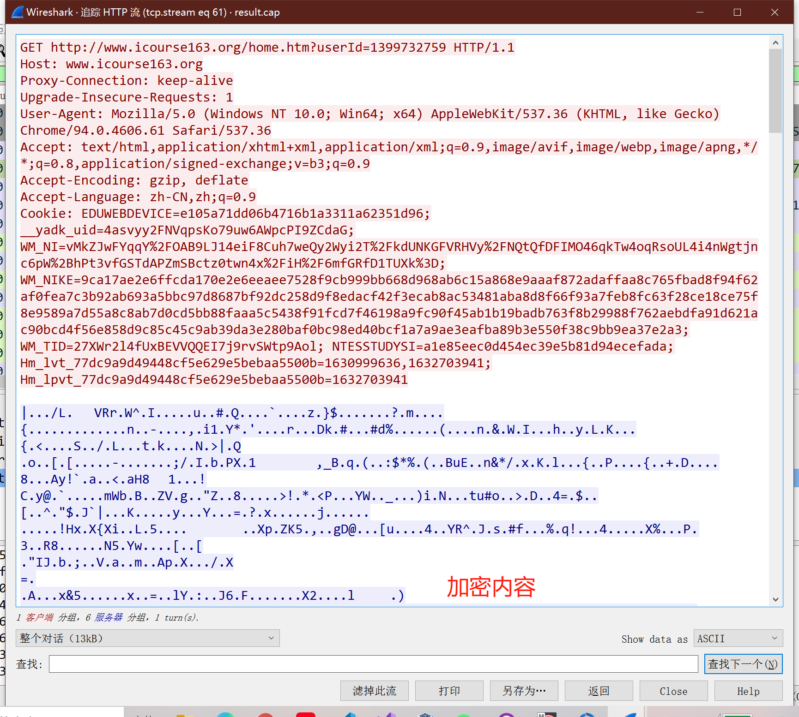
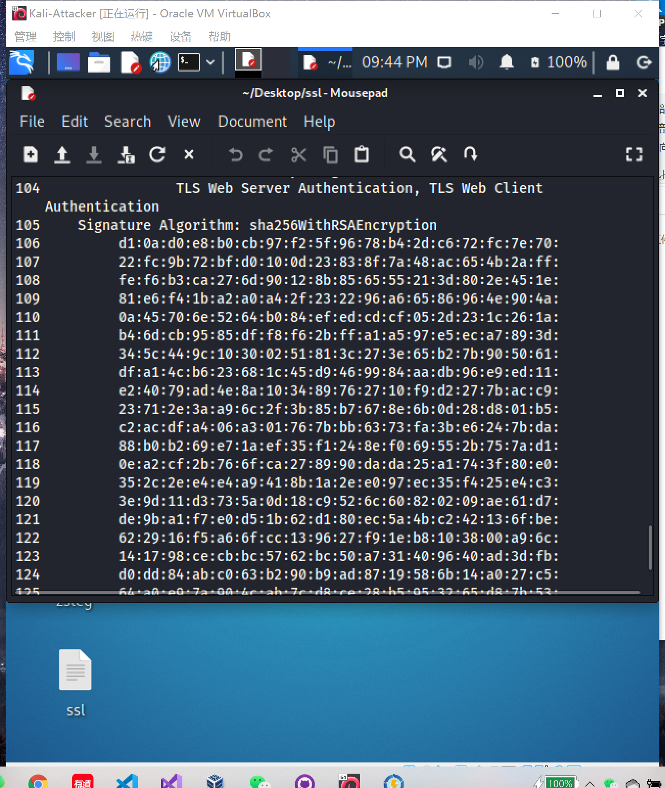

# 第三章实验
## 实验环境
- VirtualBox 6.1.22
- Kali-2021.2-amd64

## 实验目标
### HTTP代理服务器实验
- 使用http代理服务器访问HTTPS站点时，通信传输内容是否会被代理服务器“看到”？

  - A：结论是代理服务器不知道客户端和服务器的HTTPS通信内容，但代理服务器知道客户端访问了哪个HTTPS站点，这是由http代理的协议机制决定的：代理客户端会发送Connect请求到http代理服务器。

  - 实验验证：在Kali Linux中安装tinyproxy，然后用主机设置浏览器代理指向tinyproxy建立的HTTP正向代理，在Kali中用wireshark抓包，分析抓包过程，理解HTTP正向代理HTTPS流量的特点。

>提醒注意： HTTP代理服务器在转发客户端请求时，可能会添加Via字段，从而向目标站点暴露客户端正在使用代理访问。类似的，匿名通信应用tor的部分出口节点也会在http请求中自动加入via字段，向被访问站点宣告：当前请求正在使用匿名通信网络tor提供的匿名通信服务。

## 实验步骤
- 安装tinyproxy
    ```bash
        sudo apt update && sudo apt install tinyproxy
    ```
- 编辑tinyproxy配置文件，取消Allow 10.0.0.0/8注释
    ```bash
        sudo vim /etc/tinyproxy/tinyproxy.conf
    ```
    
- 开启tinyproxy服务
    ```bash
        /etc/init.d/tinyproxy start
    ```
    
- 在VirtualBox中设置端口转发
    
- 在主机测试访问百度
    
- 在Chrome中安装Proxy SwitchyOmega插件更改代理
    
    
- 在Kali中对eth0网卡抓包，将结果导入到主机用Wireshark打开进行分析
    
    


## 实验结果
- 追踪流后发现以下两种情况
    
    
- 而加密内容可以通过以下操作解出SSL从而解密获取内容，所以可得使用http代理服务器访问HTTPS站点时，通信传输内容会被代理服务器“看到”
>wireshark分析HTTP代理流量技巧：
* http.request.method eq CONNECT 查看所有HTTPS代理请求
* http.request.method eq GET 查看所有HTTP GET代理请求
* [使用wireshark解密HTTPS流量的方法](http://support.citrix.com/article/CTX116557) [方法2](https://wiki.wireshark.org/SSL)
* [使用wireshark提取pcap包中的SSL证书](http://mccltd.net/blog/?p=2036) ps:这里三个网页只有方法二能打开
  * wireshark首选项中确认TCP协议的Allow subdissector to reassemble TCP streams选项处于启用状态
  * 通过显示筛选过滤规则（例如：tcp.port == 443），找到SSL会话
  * 通过packet list里的info列找到Certificate
      * 在packet details面板里依次展开Handshake Protocol: Certificate --> Certificates，如果有多个证书，会看到多个默认折叠起来的Certificate
      * 右键选中Certificate，在右键菜单里使用Export Selected Packet Bytes功能即可导出DER格式的SSL证书
  * 使用openssl命令行工具解析DER证书
openssl x509 -in xxx.der -inform der -text -noout

## 参考资料
- [铁器 · Burp Suite](http://daily.zhihu.com/story/3905128)
- [微软hotmail SSL证书被劫持的真实案例](http://www.freebuf.com/news/45929.html)
- [GoAgent安全风险提示](https://www.bamsoftware.com/sec/goagent-advisory.html)
- [密码学应用实践的小学期Wiki（回顾签发证书和配置Apache的HTTPS站点方法）](https://c4pr1c3.github.io/cuc-wiki/ac.html)
 