# 基于Scapy编写端口扫描器
- [基于Scapy编写端口扫描器](#基于scapy编写端口扫描器)
  - [实验目的](#实验目的)
  - [实验环境](#实验环境)
  - [实验要求](#实验要求)
  - [实验过程](#实验过程)
    - [实验网络环境拓扑](#实验网络环境拓扑)
    - [TCP connect scan](#tcp-connect-scan)
      - [实验代码](#实验代码)
      - [实验结果](#实验结果)
    - [TCP stealth scan](#tcp-stealth-scan)
      - [实验代码](#实验代码-1)
      - [实验结果](#实验结果-1)
    - [TCP Xmas scan](#tcp-xmas-scan)
      - [实验代码](#实验代码-2)
      - [实验结果](#实验结果-2)
    - [TCP fin scan](#tcp-fin-scan)
      - [实验代码](#实验代码-3)
      - [实验结果](#实验结果-3)
    - [TCP null scan](#tcp-null-scan)
      - [实验代码](#实验代码-4)
      - [实验结果](#实验结果-4)
    - [UDP scan](#udp-scan)
      - [实验代码](#实验代码-5)
      - [实验结果](#实验结果-5)
  - [实验问题](#实验问题)
  - [参考资料](#参考资料)
## 实验目的
- 掌握网络扫描之端口状态探测的基本原理

## 实验环境
- python+scapy

## 实验要求
- [x] 禁止探测互联网上的 IP ，严格遵守网络安全相关法律法规
- [x] 完成以下扫描技术的编程实现
    - [x] TCP connect scan / TCP stealth scan
    - [x] TCP Xmas scan / TCP fin scan / TCP null scan
    - [x] UDP scan
- [x] 上述每种扫描技术的实现测试均需要测试端口状态为：`开放`、`关闭` 和 `过滤` 状态时的程序执行结果
- [x] 提供每一次扫描测试的抓包结果并分析与课本中的扫描方法原理是否相符？如果不同，试分析原因；
- [x] 在实验报告中详细说明实验网络环境拓扑、被测试 IP 的端口状态是如何模拟的
- [x] （可选）复刻 `nmap` 的上述扫描技术实现的命令行参数开关

## 实验过程

### 实验网络环境拓扑

### TCP connect scan
- 攻击者向受害者发送SYN包，如果能完成三次握手收到ACK，即端口为开放状态；如果仅仅收到一个RST包，即端口为关闭状态；如果什么都没有收到，即端口为过滤状态
#### 实验代码
```py
#! /usr/bin/python

from scapy.all import *

dst_ip = "172.16.111.109"
dst_port=8888

ret = sr1(IP(dst=dst_ip)/TCP(dport=dst_port,flags=0x2))
if ret is None:
    print("Filtered")
elif ret.haslayer(TCP):
    if ret[1].flags == 0x12:
        print("Open")
    elif ret[1].flags == 0x14:
        print("Close")

```
#### 实验结果
> 关闭

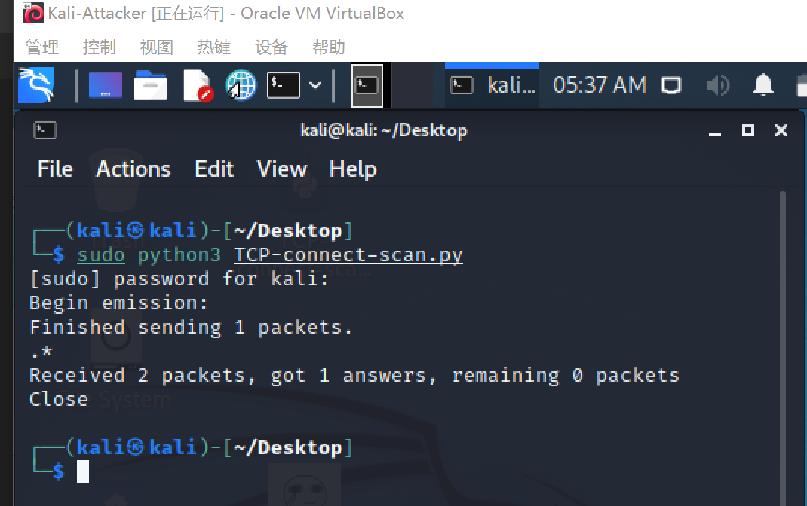
抓包结果
```bash
sudo tcpdump -i eth1 -w TCP-connect-close.pcrp
```
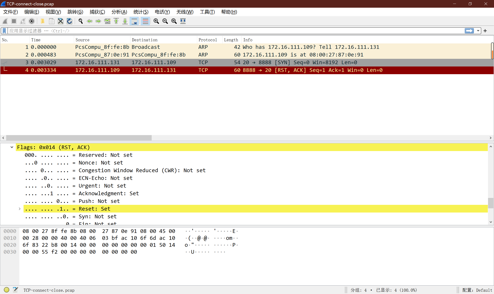

nmap复刻
```bash
nmap -sT -p 8888 -n -vv 172.16.111.109
```

> 过滤
首先在受害者设置过滤
```bash
sudo iptables -A INPUT -p tcp --dport 8888 -j DROP
```


抓包结果
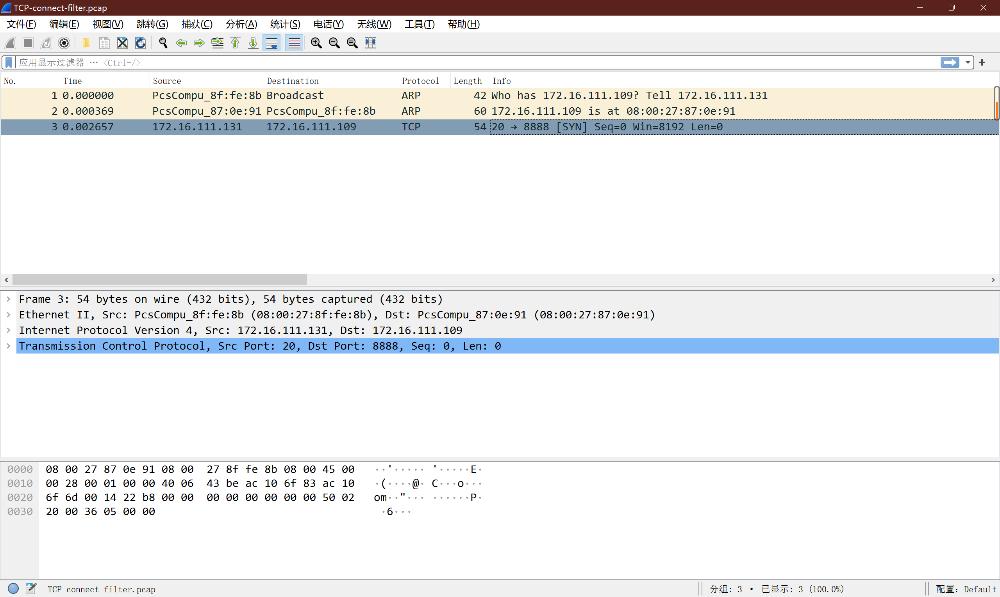
nmap复刻
```bash
nmap -sT -p 8888 -n -vv 172.16.111.109
```

> 开放
删除防火墙规则
```bash
sudo iptables -D INPUT -p tcp --dport 8888 -j DROP
```

开启端口
```bash
sudo ufw enable && sudo ufw allow 8888/tcp
```
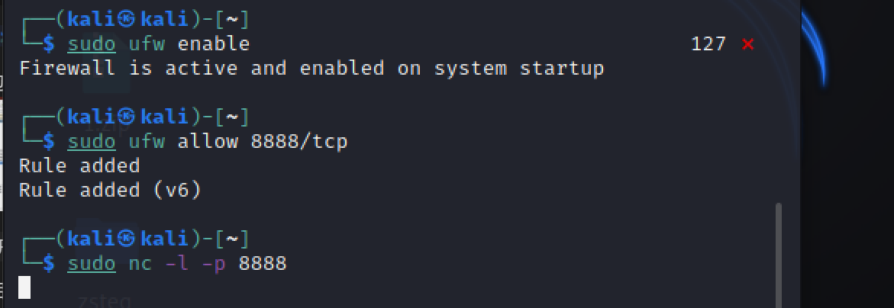
抓包结果
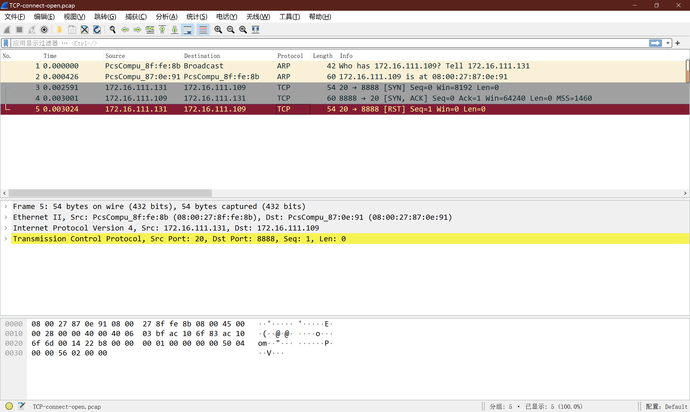
nmap复刻
```bash
nmap -sT -p 8888 -n -vv 172.16.111.109
```
### TCP stealth scan
- 攻击者发送SYN包给受害者，如果端口开启，就会收到SYN/ACK响应包，但此时攻击者会发送RST数据包给受害者，来避免完成一个完整的TCP三次握手过程，避免被防火墙探测到。当端口关闭时，攻击者会收到RST数据包；当端口处于过滤状态时，会无数据包返回或受到数据包的ICMP错误包，显示不可达错误(type =3 code 1,2,3,9,10,13)
#### 实验代码
```py
#! /usr/bin/python

from scapy.all import *

dst_ip = "172.16.111.109"
dst_port=8888

ret = sr1(IP(dst=dst_ip)/TCP(dport=dst_port,flags="S"),timeout=10)
if ret is None:
    print("Filtered")
elif ret.haslayer(TCP):
    if ret[1].flags == 0x12:
    	send_rst=sr1(IP(dst=dst_ip)/TCP(dport=dst_port,flags="R"),timeout=10)
        print("Open")
    elif ret[1].flags == 0x14:
        print("Closed")
elif ret.haslayer(ICMP):
	if int(ret.getlayer(ICMP).type)==3 and int(ret.getlayer(ICMP).code) in [1,2,3,9,10,13]:
		print("Filtered")

```
#### 实验结果
> 关闭

```bash
sudo ufw disable
sudo python3 TCP-Stealth.py
```
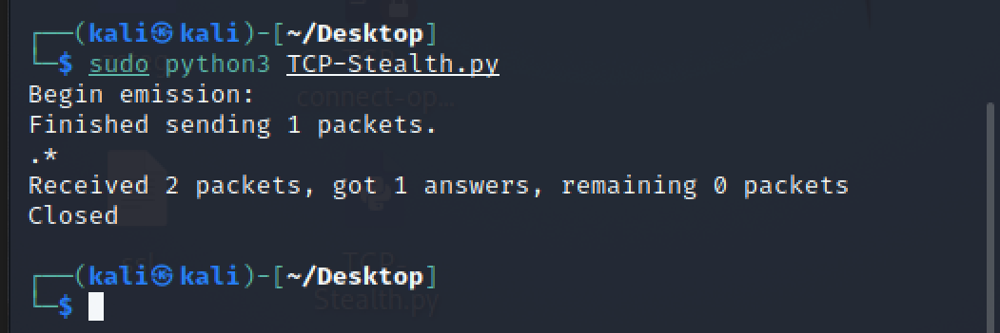

抓包结果
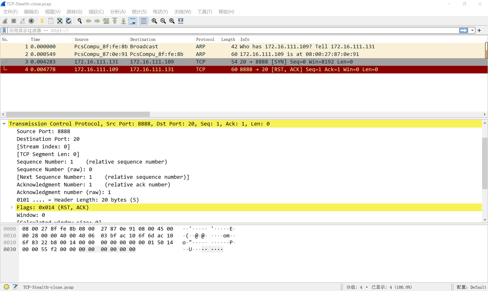
发现被害者发送的数据包为RST/ACK数据包，说明端口关闭
nmap复刻
```bash
nmap -sS -p 8888 -n -vv 172.16.111.109
```

> 过滤

设置过滤
```bash
sudo ufw enable && sudo ufw deny 8888/tcp
```
抓包结果
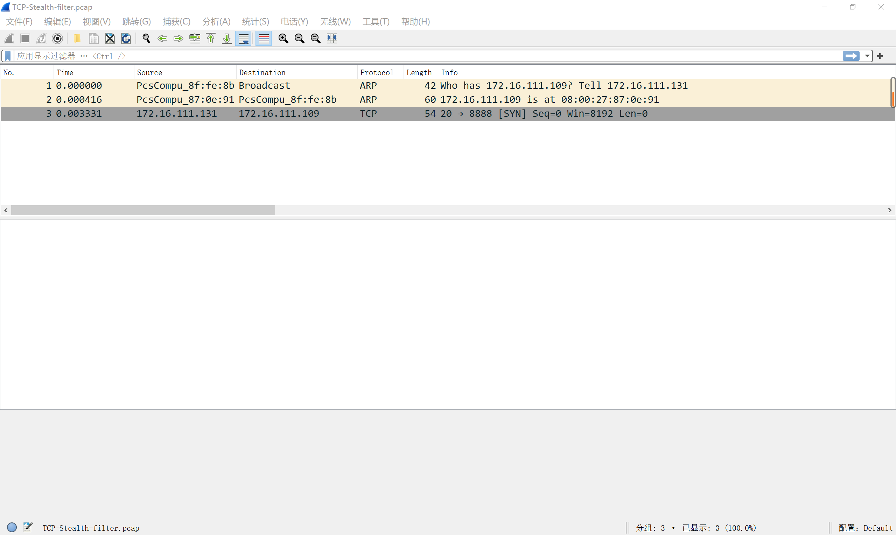
受害者只收到了一个TCP包，并没有遇到发送错误ICMP包的情况，但也可以说明端口是关闭的
nmap复刻
```bash
nmap -sS -p 8888 -n -vv 172.16.111.109
```
> 开放

设置开放
```bash
sudo ufw enable && sudo ufw allow 8888/tcp
nc -lvp 8888
```

抓包结果
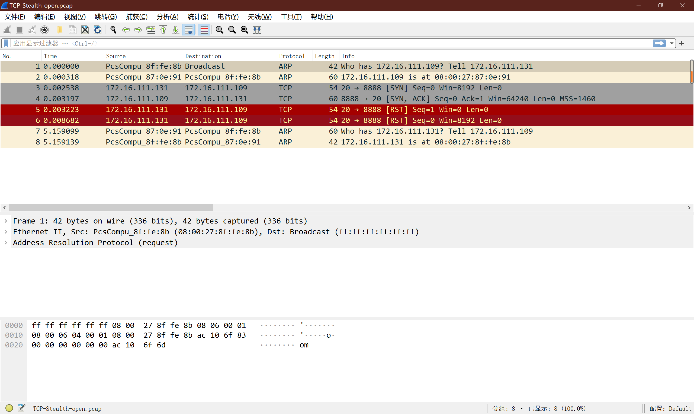
在抓包的结果中看到被害者是发送了SYN/ACK数据包，说明端口开启。且收到了攻击者发送的RST数据包，说明是进行了SYN扫描
nmap复刻
```bash
nmap -sS -p 8888 -n -vv 172.16.111.109
```
### TCP Xmas scan

| Probe Response                                      | Assigned State |
| --------------------------------------------------- | -------------- |
| No response received(even after retransmissions)    | open           |
| TCP RST packet                                      | closed         |
| ICMP unreachable error(type 3,code 1,2,3,9,10,or13) | filltered      |

#### 实验代码
```py
#! /usr/bin/python

from scapy.all import *

dst_ip = "172.16.111.109"
dst_port=8888

ret = sr1(IP(dst=dst_ip)/TCP(dport=dst_port,flags="FPU"),timeout=10)
if ret is None:
	print("Open|Filtered")
elif ret.haslayer(TCP):
	if ret[1].flags == 0x14:
		print("Closed")
elif ret.haslayer(ICMP):
	if int(ret[1].getlayer(ICMP).type)==3 and int(ret[1].getlayer(ICMP).code) in [1,2,3,9,10,13]:
		print("Filtered")
```

#### 实验结果
> 关闭

```bash
sudo ufw disable #受害者

sudo python3 TCP-Xmas-scan.py #攻击者
```
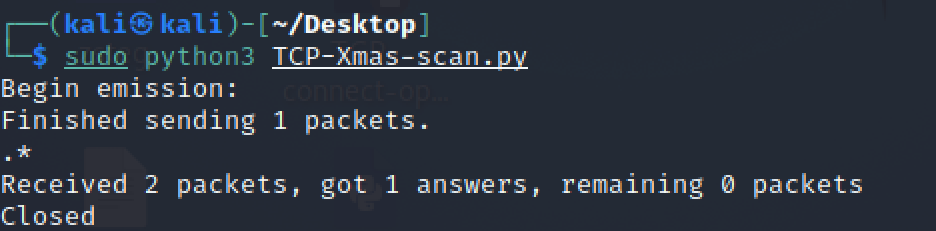
抓包结果
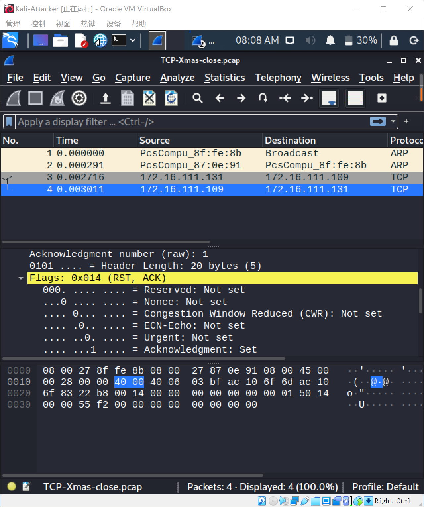
在抓包结果中被攻击者发送了RST/ACK数据包，说明端口关闭
nmap复刻
```bash
nmap -sX -p 8888 -n -vv 172.16.111.109
```
> 过滤

设置过滤
```bash
sudo ufw enable && ufw deny 8888/tcp
```

抓包结果
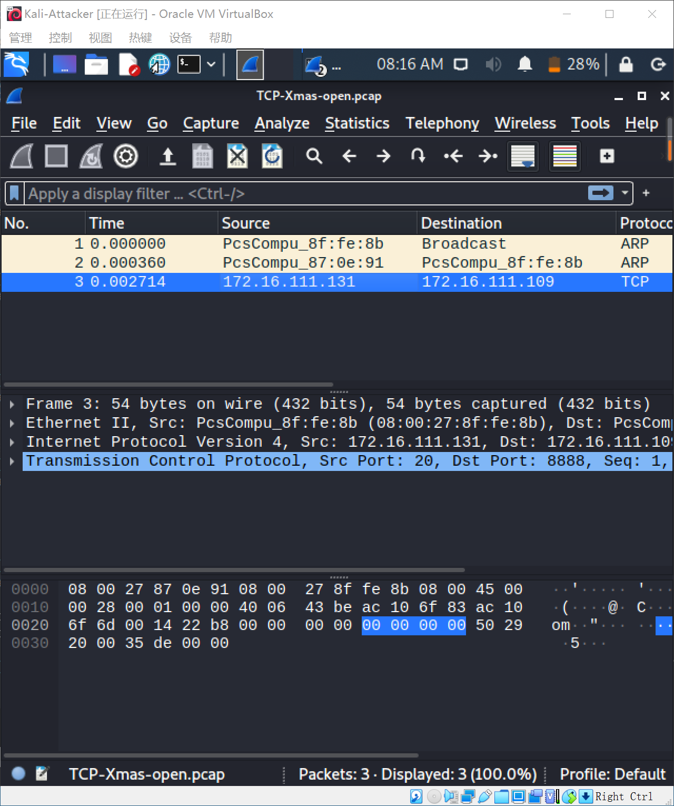
只有一个TCP包且没有响应，说明攻击者的端口处于过滤或开启状态，与预期相符合
nmap复刻
```bash
nmap -sX -p 8888 -n -vv 172.16.111.109
```
> 开放

设置开放
```bash
sudo ufw enable && sudo ufw allow 8888/tcp
```

抓包结果
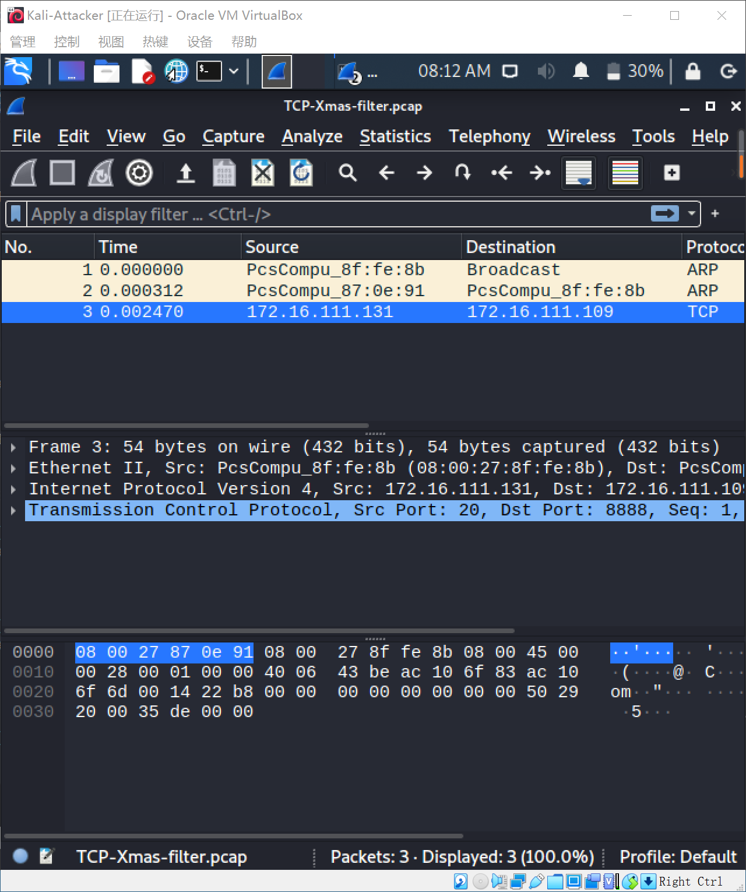
只收到了一个TCP包且没有响应，说明靶机端口处于过滤或开启状态，与预期相符合
nmap复刻
```bash
nmap -sX -p 8888 -n -vv 172.16.111.109
```
### TCP fin scan
仅设置TCP FIN位，端口判断与Xmas一直
#### 实验代码
```py
#! /usr/bin/python

from scapy.all import *

dst_ip = "172.16.111.109"
dst_port=8888

ret = sr1(IP(dst=dst_ip)/TCP(dport=dst_port,flags="F"),timeout=10)
if ret is None:
	print("Open|Filtered")
elif ret.haslayer(TCP):
	if ret[1].flags == 0x14:
		print("Closed")
elif ret.haslayer(ICMP):
	if int(ret[1].getlayer(ICMP).type)==3 and int(ret[1].getlayer(ICMP).code) in [1,2,3,9,10,13]:
		print("Filtered")

```

#### 实验结果

>关闭

```bash
sudo ufw disable #受害者

sudo python3 TCP-FIN.py #攻击者
```
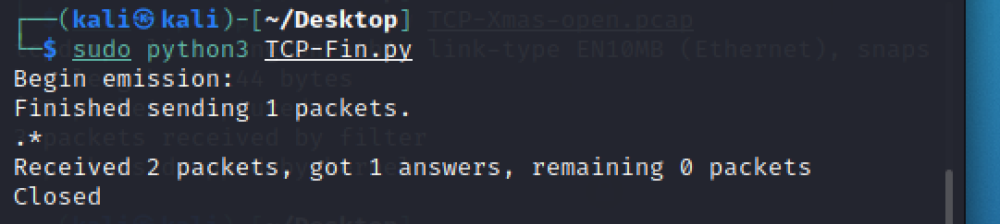
抓包结果
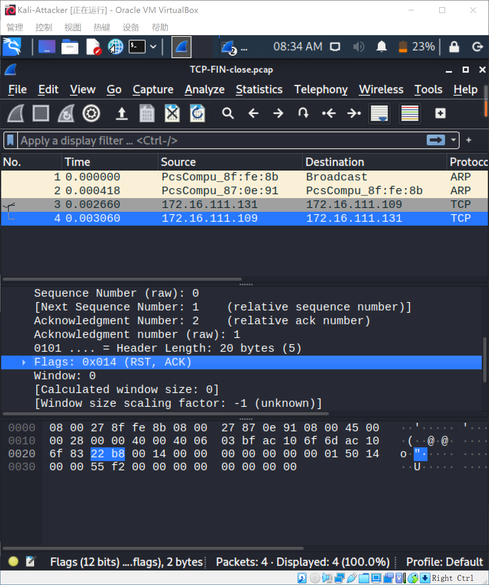
在抓包结果中有RST/ACK数据包，说明端口关闭
nmap复刻
```bash
nmap -sF -p 8888 -n -vv 172.16.111.109
```
> 过滤

```bash
sudo ufw enable && sudo ufw deny 8888/tcp
```
抓包结果
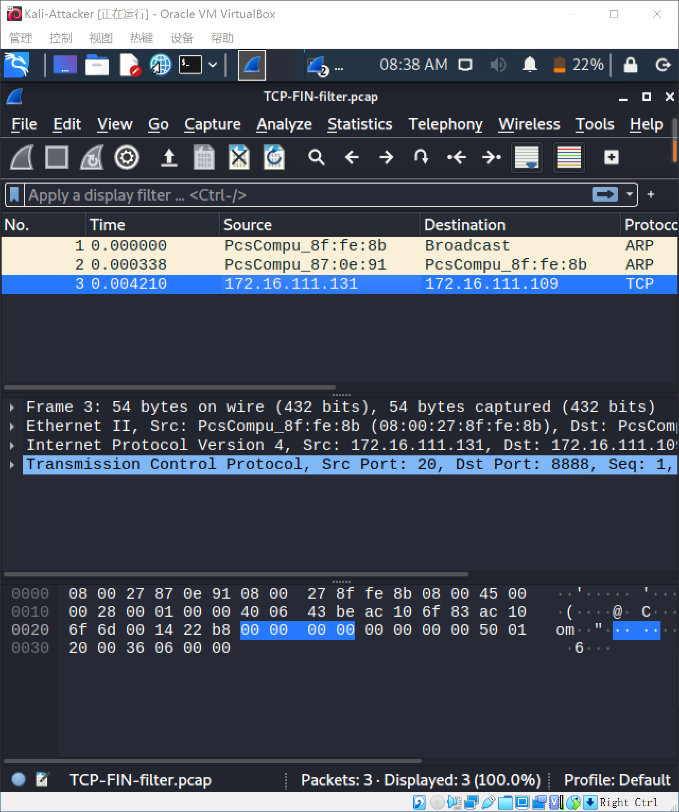
靶机只收到了一个TCP包且没有响应，说明靶机端口处于过滤或开启状态
nmap复刻
```bash
nmap -sF -p 8888 -n -vv 172.16.111.109
```
> 开启

```bash
sudo ufw enable && sudo ufw allow 8888/tcp
```
抓包结果
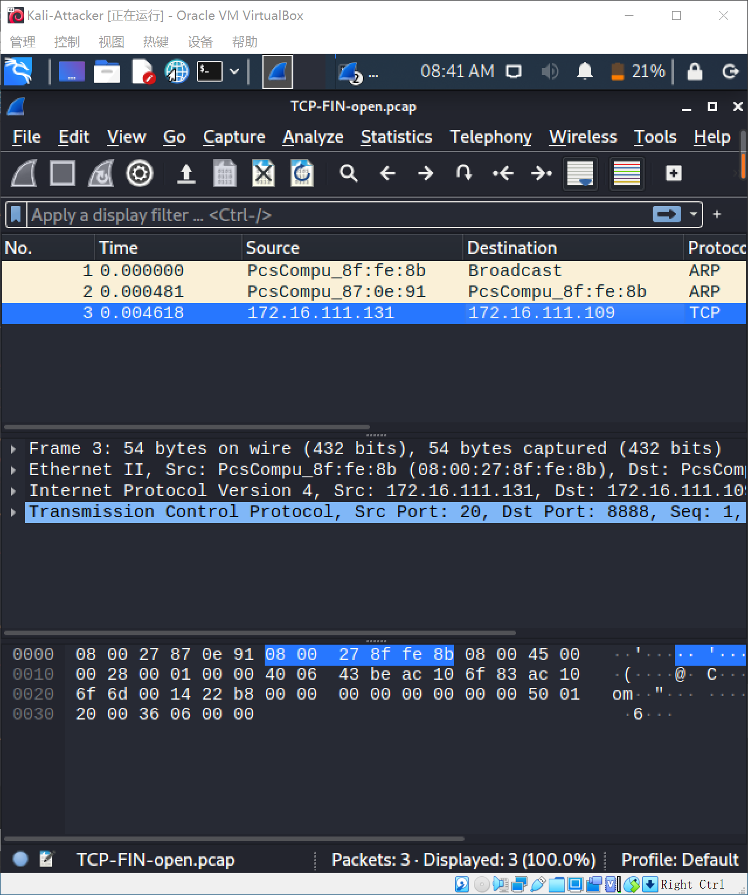
靶机只收到了一个TCP包且没有响应，说明靶机端口处于过滤或开启状态
nmap复刻
```bash
nmap -sF -p 8888 -n -vv 172.16.111.109
```
### TCP null scan
发送TCP数据包时不设置任何位,端口判断与Xmas扫描一致
#### 实验代码
```py
#! /usr/bin/python

from scapy.all import *

dst_ip = "172.16.111.109"
dst_port=8888

ret = sr1(IP(dst=dst_ip)/TCP(dport=dst_port,flags=""),timeout=10)
if ret is None:
	print("Open|Filtered")
elif ret.haslayer(TCP):
	if ret[1].flags == 0x14:
		print("Closed")
elif ret.haslayer(ICMP):
	if int(ret[1].getlayer(ICMP).type)==3 and int(ret[1].getlayer(ICMP).code) in [1,2,3,9,10,13]:
		print("Filtered")

```

#### 实验结果

> 关闭
```bash
sudo ufw disable #受害者

sudo python3 TCP-null.py #攻击者
```
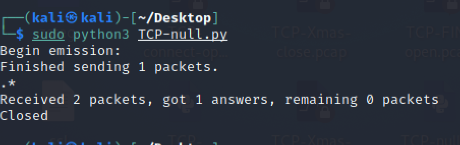

抓包结果
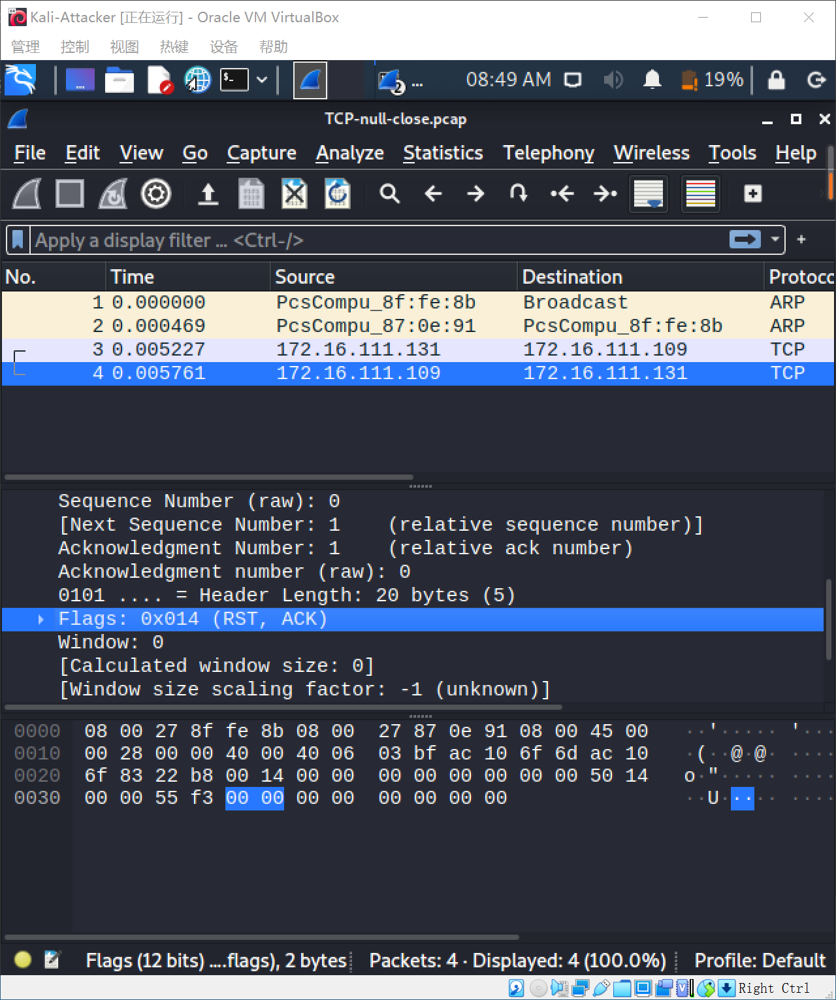
在抓包结果中有RST/ACK数据包，说明端口关闭
nmap复刻
```bash
nmap -sN -p 8888 -n -vv 172.16.111.109
```
> 过滤

```bash
sudo ufw enable && sudo ufw deny 8888/tcp
```
抓包结果

靶机只收到了一个TCP包且没有响应，说明靶机端口处于过滤或开启状态
nmap复刻
```bash
nmap -sN -p 8888 -n -vv 172.16.111.109
```
> 开启

```bash
sudo ufw enable && sudo ufw allow 8888/tcp
```
抓包结果
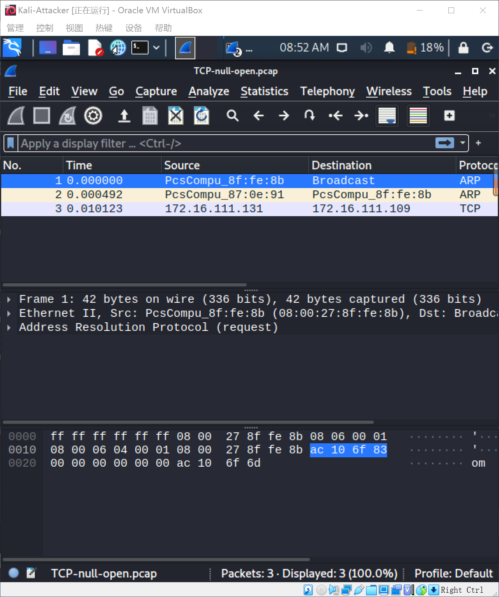
靶机只收到了一个TCP包且没有响应，说明靶机端口处于过滤或开启状态
nmap复刻
```bash
nmap -sN -p 8888 -n -vv 172.16.111.109
```
### UDP scan
UDP是一种无连接的传输协议，它不保证数据包一定到达目的地。当攻击者收到来自靶机的UDP响应包时，说明端口处于开启状态，但同时如果没有得到响应，端口也可能处于开启或过滤状态；如果收到ICMP端口不可达错误，说明端口关闭；如果是其他ICMP错误，说明端口处于过滤状态。

#### 实验代码
```py
#! /usr/bin/python

from scapy.all import *

dst_ip="172.16.111.109"
dst_port=53

pkt = IP(dst=dst_ip)/UDP(dport=dst_port)
ret = sr1(pkt,timeout=10)
if ret is None:
	print("Open|Filtered")
elif ret.haslayer(UDP):
	print("Open")
elif ret.haslayer(ICMP):
	if int(ret.getlayer(ICMP).type)==3 and int(ret.getlayer(ICMP).code)==3:
		print("Close")
	elif int(ret.getlayer(ICMP).type)==3 and int(ret.getlayer(ICMP).code) in [1,2,9,10,13]:
		print("Filtered")
elif ret.haslayer(IP) and ret.getlayer(IP).proto == 17:
        print("Open")

```

#### 实验结果

> 关闭

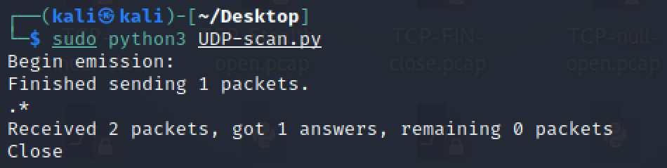
抓包结果
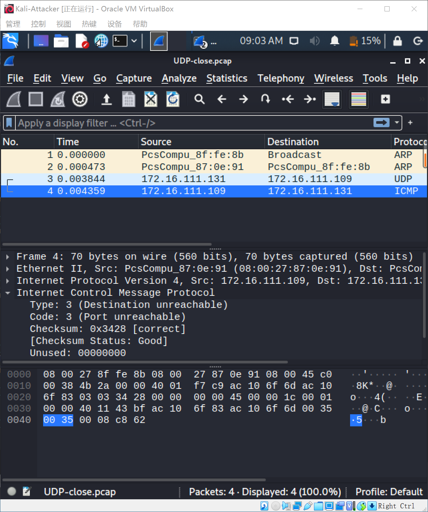

有来自攻击者的UDP数据包，并且发送了ICMP端口不可达的数据包，在ICMP数据中Type和code均为3，说明端口关闭，符合预期结果
nmap复刻
```bash
nmap -sU -p 53 -n -vv 172.16.111.109
```
> 过滤
```bash
sudo ufw enable && sudo ufw deny 53/udp
```
抓包结果

在靶机中收到了来自攻击者的UDP数据包，但没有做任何响应，说明端口处于过滤状态
nmap复刻
```bash
nmap -sU -p 53 -n -vv 172.16.111.109
```
> 开启

```bash
sudo systemctl start dnsmasq

sudo ufw enable && sudo ufw allow 53/udp
```

抓包结果
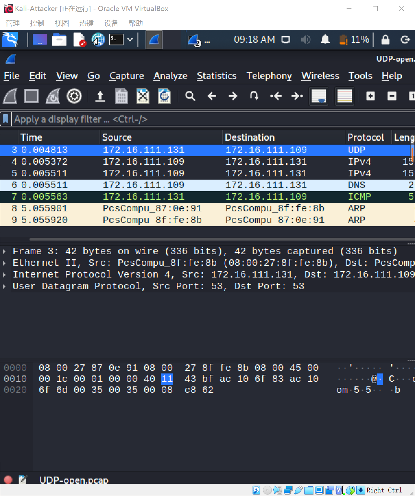
抓取的包中可看到靶机接收到了攻击者发送的UDP数据包，并发送了响应包，说明端口开启
nmap复刻
```bash
nmap -sU -p 53 -n -vv 172.16.111.109
```
## 实验问题
1. `sudo python XXX.py`无法识别scapy包的问题 需将python改为python3
2. python文件从windows导入kali运行偶尔会有空格报错的问题，使用vim重新编辑即可
## 参考资料
- [第五章 网络扫描](https://c4pr1c3.github.io/cuc-ns/chap0x05/main.html)
- [2021-ns-public-EddieXu1125](https://github.com/CUCCS/2021-ns-public-EddieXu1125/tree/chap0x05/chap0x05)
